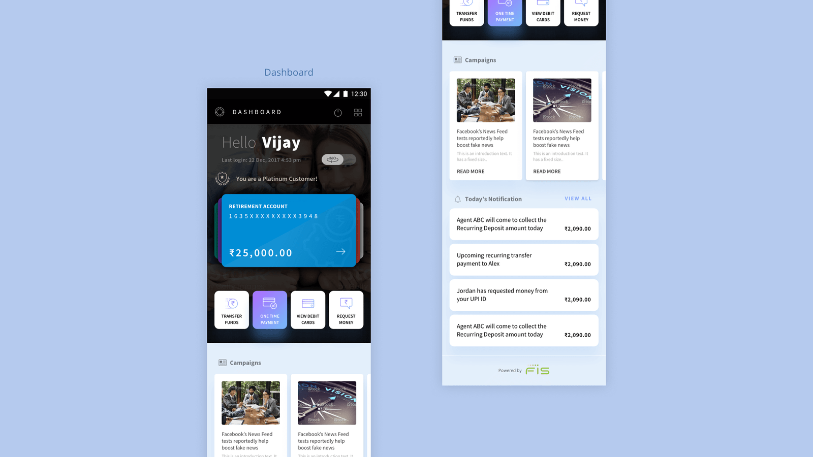
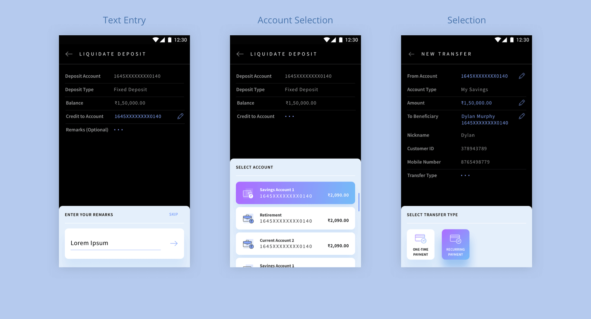
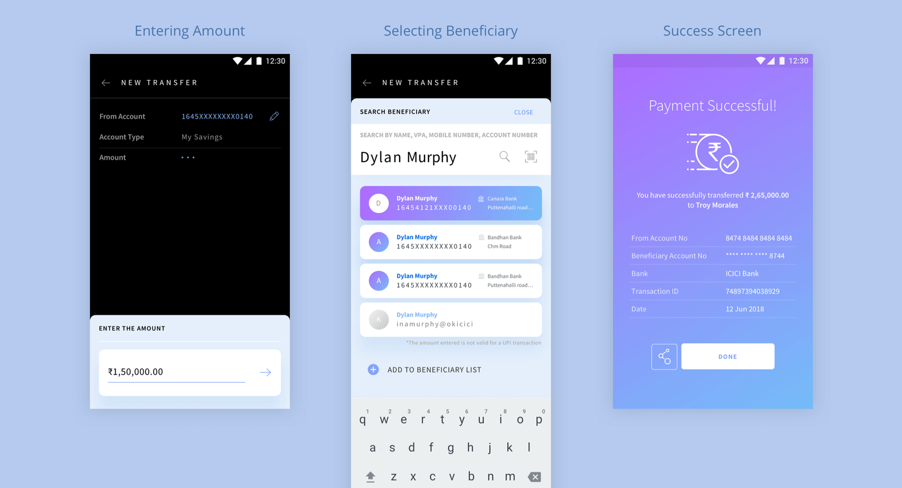
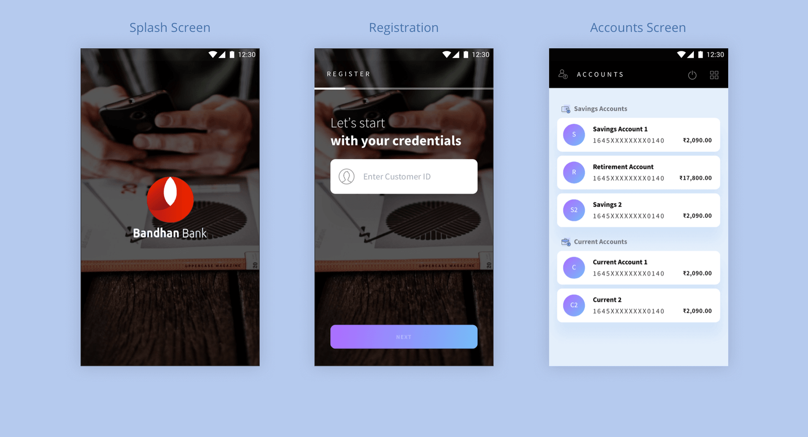
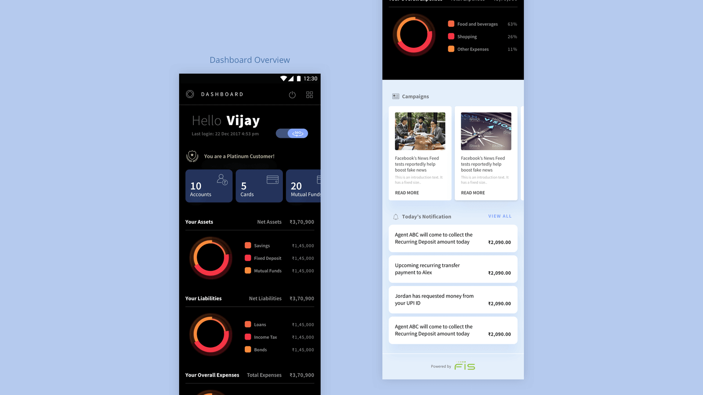
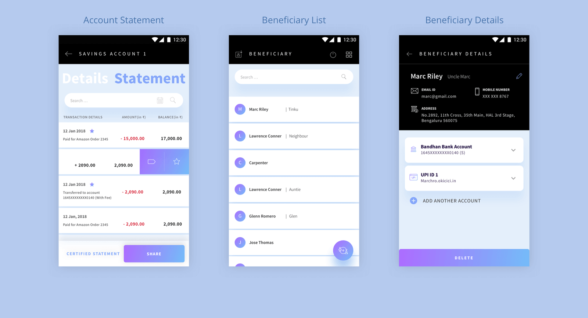

___

<b>Client</b>

<b>Industry</b>

<b>Year</b>

<b>Deliverables</b>

FIS Solutions

Core banking application for rural bankers

2017-2018

Tablet App Design 
Mobile App Design

___

# THE CHALLENGE

The project involved the design of an application for mobile bankers that would use it on a tablet in rural parts of India in order to provide banking services to villagers. There were unique challenges that included things like intermittent internet connectivity, hurdles due to illiteracy of the client, managing trust in such a scenario, as well as being mindful of the usage of the tablet in outdoor settings. This was an incredibly fun project that lasted about a year in total. 

## THE OUTCOME

- 6 clicks to complete a transfer – a 40% reduction
- Get to your task faster
- Security of transactions done by audio announcements

## THE BANKING LANDSCAPE

India, not uniquely, has seen the banking industry face pressure from outside it through indirect competitors like PayTM, Freecharge, PhonePe and the like. These players offer banking-like services through the use of their electronic wallets and people have been taking to it really quickly.

While the pressure making traditional banks modernise their digital interfaces may have been questionable before, the RBI providing PayTM, et al, quasi-bank status made this pressure real.

There was no question that these interfaces needed to modernise after that point. While the big banks with their own teams of technologists were trying to respond to this change, FIS was in a unique position to be able to evolve their platform outside the constraints of their client bank’s internal political and technological structures. This enabled Redd to work with them to provide a design that made an evolutionary jump instead of just taking the next step forward.

## THE INDIAN DEMOGRAPHIC

Banking has traditionally been considered an offline process in India. People still prefer personal interactions to get their work done but the changing demography of India where more people are travelling to different cities to work has seen the need for money transfers Mobile application and such arising. These people have appreciated the benefits provided by electronic transfers, ATM’s and netbanking facilities and their attitudes towards banking has also, consequently, been evolving.

While the majority still perform only a few functions like withdrawals, deposits and transfers with their banking applications, they are still not aware of the different possible functions in a bank.

The application, therefore, needed to allow for these frequently performed functions to be done easily, but also to allow the user to discover all other functions that are possible with a bank.

Another important challenge was to accommodate a varied target audience. India is a vast and diversely populated country. Banking needs to be accessible to the entire population, not just certain types of people. This meant that the application’s design had to accommodate for as many different user types as possible to avoid exclusion.

## THE APPROACH

Banking is a vast field with a huge number of features and functions. So to handle this complex subject, we took the following approach:

#### CONDUCT MARKET RESEARCH

We conducted market research against other direct and indirect competing offerings from the perspective of design trends and user familiarity so we could retain well-understood interaction paradigms.

#### BUILD AN INTERACTION MODEL THAT WORKS ACROSS FUNCTIONS

The second obstacle to overcome was to design an interaction model that would work across functions like money transfers, insurance renewals, loan requests, etc.

#### PROPOSE A MODEL AND FIX AFTER ANALYSIS

As the field of banking is so very extensive and each of the modules quite complicated, especially when you take into consideration the various changes that each client bank would want to bring in, one could not expect to ask all the questions ahead of time and arrive at a business analysis document and then take it forward. We took the approach of proposing a model based on initial research and then change and make the fixes after focussed discussions with regard to that module. We expected a higher number of revisions because of this approach, but there would be no work-around.

#### DEVELOP A PROTOTYPE AND ACQUIRE FEEDBACK

To test the usability of the application, we built the prototypes and tested it against actual users to acquire feedback and make the fixes before taking it forward to implementation.

## THE PROCESS

#### INPUT METHODS

Banking processes normally involve a lot of input from the users. People have to fill up long forms and authenticate themselves to complete even a simple process. When this form is taken online, users tend to make a lot of errors or skip important fields because of the screen size and direct adaptation of the offline forms. Our goal was to reduce as many errors as possible. To achieve this, we came up with a new input mechanism which would allow the user to focus on only one field at a time. We also ensured that the user would not have to move her/his eye up and down to look for fields, the fields would all appear in the bottom part of the screen. This made sure that the mental load on the user was less, which would eventually lead to faster processes with least possible errors.

#### BENEFICIARY OR CONTACT

In today’s transfer process, users have to create a beneficiary every time, wait for it to get authenticated by the bank and then transfer money to them. Also, multiple transfer modes like UPI, AEPS, IMPS, etc., just add to this complexity.

Imagine having to create multiple beneficiaries for one person and then having to remember all of them without any confusion. After a lot of brainstorming, we decided to treat beneficiaries like contacts from our contact book. Users can create a parent beneficiary and then add different modes under each one. This allowed users to add multiple modes of payment under one beneficiary without having to enter the parent details all over again.

#### TRANSFER PROCESS

Transferring money from one account to another is the most commonly used feature in any banking application. We wanted to design a process that would speed up the process without increasing the cognitive load on the user. Currently, the process of transferring money changes from mode to mode. Our first step was to combine all of these processes without affecting the dependencies. This would ensure that the user did not have to learn multiple steps and complete the task of transferring money easily.

## WHITE-LABELLED APPLICATION

One of the biggest challenges with this application was to build it in a way that would allow multiple banks to use it by adding their brand colours and identity to it. Our visual design thus prescribed that the application be conceived on one primary colour and a primary gradient.

This ensured that the design of the application would not be compromised by changing the colours. We also realised that the application needed to be constructed in a modular way to allow banks to add and remove features without affecting the user experience.

