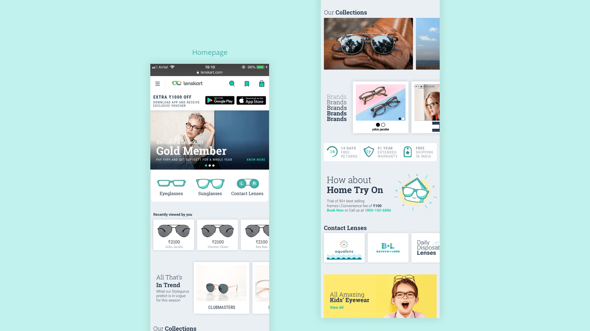
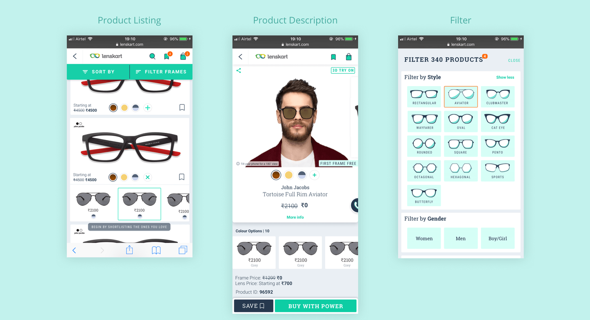
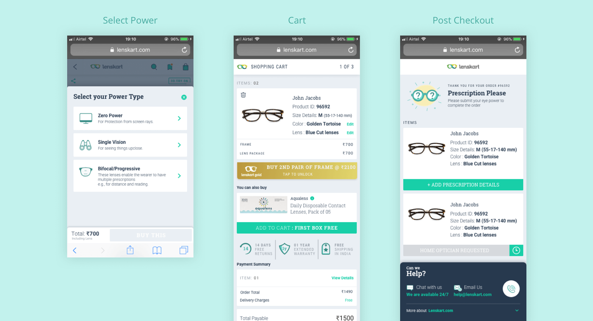
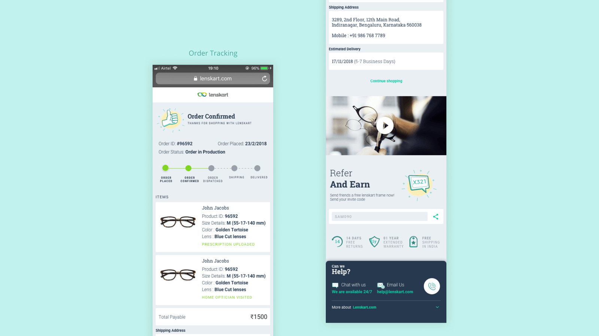

___

<b>Client</b>

<b>Industry</b>

<b>Year</b>

<b>Deliverables</b>

Lenskart

Prescription Glasses 
Sunglasses 
Contact Lenses

2018

Website design 
Communications

___

# DESCRIPTION

The offline stores, the desktop website and the mobile applications that Lenskart transacted with customers over were doing very well. But the mobile website was converting the least number of visitors into customers as compared with their other platforms. The client had consequently used that touchpoint to direct customers to download their mobile apps as a stop-gap solution instead until they had a chance to dedicate the resources required to overhaul the website completely.

Our challenge was to design a mobile e-commerce site that would help in better conversion and work seamlessly with Lenskart’s offline stores and processes. The client had also worked with other UX agencies before working with us and had not been able to achieve the goals that they had set out to achieve. They had, therefore, proposed some key performance indicators (KPI’s) as goals for us to achieve and required us to guarantee them.

We examined their performance data for the past few months and also conducted a study of their existing site to understand whether the numbers proposed could be achieved. After this, we felt confident enough to take on the challenge.

## THE OUTCOME

The client has implemented the design we created for them on their mobile website and also applied it to their Android and iOS apps. All key performance indicators are looking up.

- 8 Clicks to finish a purchase – 25% reduction
- 3 eyewear in a screen – 100% increase
- 80% of users found new design engaging
- 90% of users found new design clearer
- 8 personas addresses
- Offline store integration

## THE APPROACH

Before beginning work on the design for the new website, we discussed what our approach would be and ascertained the following guidelines:

- There was extensive market research done by the client so that information would be provided to us. It established eyewear as a fashion statement in addition to providing pure utility.
- We had complete freedom to create the design we needed without restricting ourselves to what was already designed and delivered on the desktop website or the mobile applications.
- We set a goal for ourselves to create a seamless experience between the mobile website and the offline stores.
- Wherever we disagreed with the client, the client agreed to performing A/B testing to determine the right approach.

## THE PROCESS

### IDENTIFYING PROBLEMS

We worked very closely with the Lenskart team to identify the problems and recognise the user’s needs. This meant studying their research documents and examining their website analytics very closely. We then designed user journeys that didn’t repeat these problems while simultaneously addressing the needs of each type of user.

### THE RIGHT METAPHOR

We wanted the mobile web experience to reflect a person’s experience of walking into the store as closely as possible. We observed that customers that purchased glasses were trying on more than 30 frames per session and wanted to bring that learning to the web. We designed the interactions such that they allowed customers to easily view a lot of different frames per session, thus increasing the chances of conversion greatly.

### NARROW OR WIDE

For a lot of people, eyewear is an integral part of their life. It’s the first thing you wear as soon as you wake up and start the day. But over the last few years, it’s become more than that, it has occupied a space outside of utility and become a style statement. We wanted to take advantage of this positioning and treat the website more as a fashion brand as opposed to a utilitarian one. We therefore needed to design the site that not only helped narrow choices for a user with each subsequent step but also created paths for them to discover more products and styles to increase the chances of conversion.

### UNIVERSAL COMMERCE

While talking to people at the client’s stores and asking why they shopped at the store instead of shopping online, we understood their reasons for doing so. This made it clear to us that attempting to convert users to shopping online only would not address all their needs. We therefore took a “universal commerce” approach where we kept in mind the offline features that were important to some of these users.

So customers could purchase the product online and get it delivered either to a store near them or to their home, but perform a return or exchange at the store/home; or even place the order online, try it on at the store/home and complete the purchase there.

## PROVING OUR CASE

We tested the prototypes we designed on 10 users and recorded the user’s brain activity using an EEG headset while performing various everyday tasks. This way, we could understand what the user was feeling without the need to ask them questions about what they were thinking. They could just stay focussed on the task that we had asked them to perform.

We understood the successes of the system we had designed and identified a few optimisations that we could make based on this test. We then made these rectifications before finalising the design.

