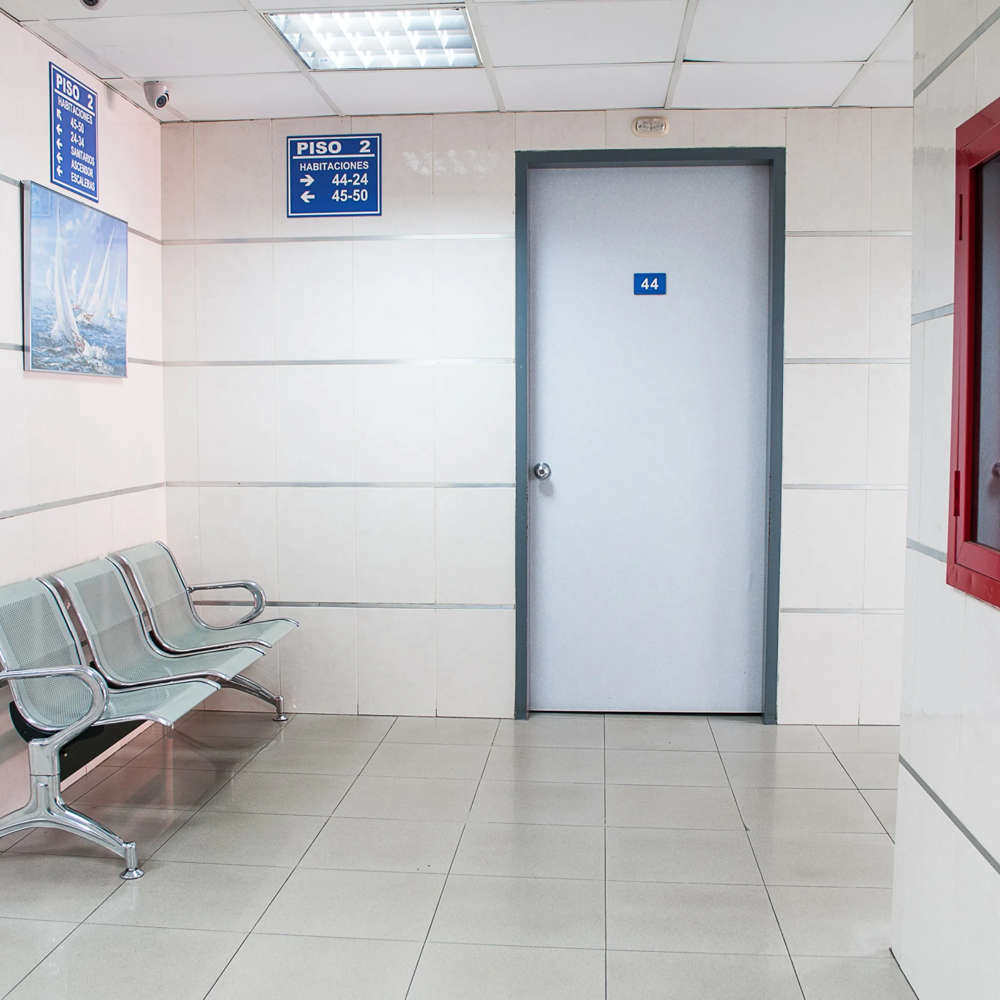

Post my experience in designing an interface for a birthing hospital the importance of UX in this space was highlighted.

___

At 37, Anu is having her first pregnancy. She’s nervous. She relies on her hospital for timely support and information. But she has to wait three hours for an appointment and doesn’t get notifications. She plans to renege.

Modern medical care needs to go beyond helping Anu deliver her baby, and improve her overall _patient experience_. With rampant competition and an aware, digitally savvy customer base, patient experience — timely appointments, easy access to information and good communication with doctors — can increase patient loyalty besides eliminating waste and reducing costs. An effective, intuitive way for hospitals to improve patient experience is to embrace technology and UX design principles.

## **HOW DO UX DESIGN PRINCIPLES HELP IN DELIVERING BETTER PATIENT EXPERIENCE?**

It involves using technology to reorganise services _according to how patients behave as opposed to how the hospital’s default system runs._ From our research, we’ve identified four UX drivers that can improve patient experience:

> ”AN EFFECTIVE, INTUITIVE WAY FOR HOSPITALS TO IMPROVE PATIENT EXPERIENCE IS TO EMBRACE TECHNOLOGY AND UX DESIGN PRINCIPLES. 

## **#1 ELASTICITY**

This refers to how “elastic” or flexible the hospital’s _communication_ is. For example, customers during registration are asked for unnecessary information. This creates delay and distress. Instead, a quick online registration process through a bot in an app can ensure only Anu’s critical information is requested on priority. Another pain point for Anu is having to go to multiple places for information. Consultation cards on the same app can have their status updated to let Anu know what she needs to do next, depending on where she is in her pregnancy journey. For example, if her doctor gives complex post-consultation instructions, then cards appearing after the consultation can break them down into easy steps for Anu.

## **#2 EASE**

This deals with how the hospital helps the patient save _time_. Research shows the more touch points a patient has to go through, the greater their dissatisfaction. Through an online experience, Anu’s entire user journey can be completed on the same app — from check-in, to seeing her spot in the queue, to getting updated on doctor status, etc. Another way of creating ease is time slots instead of exact times. Research shows failure to comply with exact times causes patients to become anxious. Instead, a flexible time slot manages Anu’s expectations and, if she is 15 minutes late, she doesn’t create a domino effect on other patients’ wait time. Anu also shouldn’t be wasting time searching for medical records before every consultation. By digitising everything on the app, she or even her spouse gets easy access. A chat facility is another great time-saver; she can just connect with her doctor instantly in case of a query.

## **#3 EMPATHY**

Good UX is about increasing empathy for Anu’s journey. In addition to many of the above tactics, there are more overt ways to do this. For example, the app can collapse Anu’s complex pregnancy journey into easily accessible milestones on a timeline. So, on any given day, she can take comfort in looking at her journey. Moreover, she can book lab appointments and RSVP for events from this view. Giving Anu access to a community is another example. A lot of first-time parents are anxious. Accessing a community through the app can open up invaluable peer-group support.

## **#4 EFFICIENCY**

Introducing technology with UX design principles can streamline processes and remove inefficiencies. This increases productivity and brings down costs. That’s not all; the platform becomes a one-stop shop for all of the hospital’s packages. This creates simple, effective communication around each package which, in turn, can result in better conversions.

# Conclusion

In conclusion, _sensitivity_, _relevance_ and _sociability_ guiding all UX decisions make for a vastly improved patient experience. Also, let’s not forget integrating tech and UX paves the way for machine learning and AI which can unlock a whole new level of efficiency and patient satisfaction!