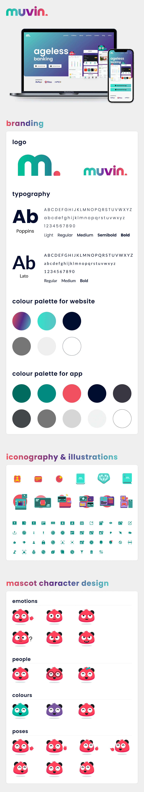
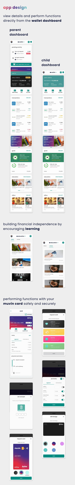

___

<b>Client</b>

<b>Industry</b>

<b>Year</b>

<b>Deliverables</b>

Finone Financial Tech Solutions

Finance

2021

Branding 
App 
Website 
Credit Cards 
Mascot 
Communications 

___

# DESCRIPTION

This project included the design of the brand, website and app for a neobank. The product differentiates itself by simplifying financial learning for young people and also enables them to operate their own faux bank account with the help of their parents. It reimagines banking with features that young adults care about, including being able to transfer money between friends, split bills, set goals and save for them all while getting rewarded for doing so.

