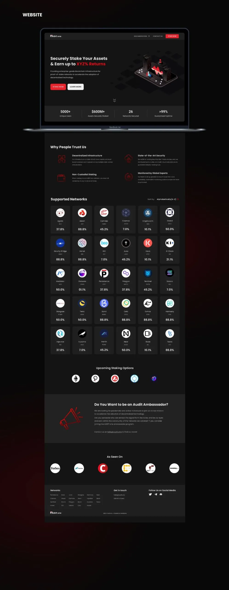

___

<b>Client</b>

<b>Industry</b>

<b>Year</b>

<b>Deliverables</b>

Audit.One

Cryptocurrency Validators 
Staking Services

2022

Website design 
Communication design

___

# DESCRIPTION

Audit.one is a significant revenue generator for the Persistence group and their existing website needed to be revamped to be able to cater to their audience better. We had to research and understand the very technical and complex nature of the industry they’re in, in order to redesign the website.

