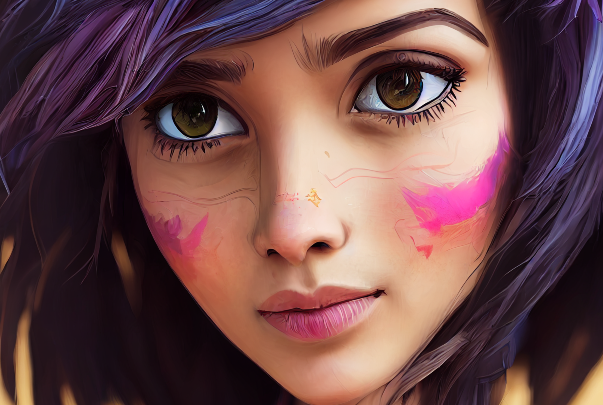
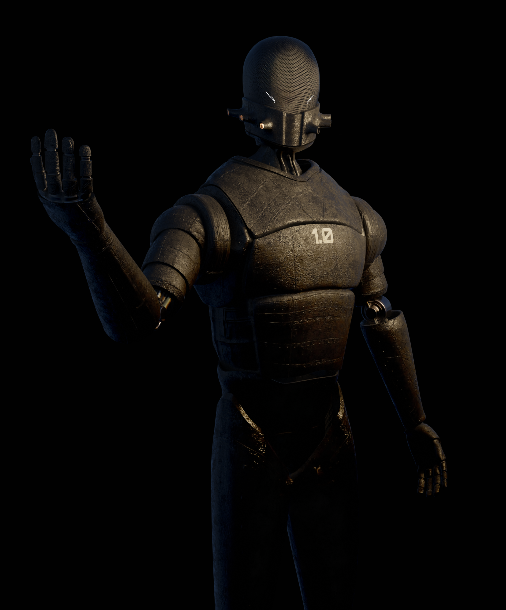

Artificial Intelligence (AI) based design tools have captivated our collective imagination in the field of design. Here are my experiments.

___
# Introduction

Artificial Intelligence (AI) based design tools have captivated our collective imagination in the field of design. Being able to imagine something and bring it to life in the form of an image or video is a tempting prospect. While one part of the design world lamented the fact that these tools may replace our roles, I belong to the small minority that looks at these new technologies with the hope that it would lead to better design. I could after all never call myself a designer if I had never run into Photoshop all those years ago.

So I dove in head-first into figuring out what this new frontier holds for us. This is an on-going experiment and I am just documenting my learnings as I go along.

> If not for Photoshop, I may have never become a designer

# What did I expect?

While I started exploring this simply out of curiosity, it later was also a business decision as I anticipated that it would help my small team do more. After all we were about to launch a second product at work and I had to find ways to  sustain all of it with the current team size.

Therefore, I started by trying to find answers to the following:

1. What are the tools that are available?
2. What’s the learning curve to use these technologies?
3. How much control do I have over the output?
4. How much post-processing is required?
5. Can they produce consistent quality and style over a period of time?
6. Are the technologies mature enough for everyday use?

# October 2022: AI based art NFTs

I had heard of AI generated art and was amazed by what I saw in some videos but I had no idea how this was done or how. I happened to run into NFT’s on Rarible at that time and saw this collection of AI based images that someone had made. I was just so amazed with its accuracy that I ended up buying a few of them simply in the hope that I was supporting someone who was working on this and possibly getting flack for not being a true artist.

## Learnings from this phase:

1. AI art is dividing the world into the group that thinks this is art and the group that thinks it isn’t
2. No one expected AI would set its sights on the creative fields first.

# February 2023: MidJourney

I ran into MidJourney back in late 2022 through a colleague who was using it to create some artwork that I was quite impressed with. I thought to try it out but the version that existed at the time was just not that great with the simple “prompts” I was able to provide it. It took too many tries and much too long to generate something just remotely close to what I wanted.

I saw others developing images that looked a lot better and saw what they had prompted MJ in order to produce it. I copied one of them that had produced a very cool image of a cat to produce an image of a dog. My dog image had three eyes!

My attempts at producing human portraits didn’t fare much better. All of them had messed up hands or too many fingers for some reason. I was producing Dali-esque images without intending to.

I walked away from a two hour session kind of impressed, but feeling that the tech wasn’t there yet.

## Learnings from this phase:

1. The learning curve was too great as I would never be able to understand all the words and prompts and styles and exclusions if I had to type all of this out
2. The interface (Discord) was absolutely not the one that I could imagine using to produce images. It was a terrible fit and since I was in a public channel typing out my requests, I felt like I was being watched while I fumbled around trying to produce the output I wanted.

The tech wasn’t there yet, but I saw potential.

# March 2023: MidJourney V5

MJ V5 launched this month and I got really interested. This was a big update and they got a whole lot of changes in. They got the hands right, they got faces right, the quality of images was just amazing and the initially released with the Zoom Out feature that essentially imagined the parts of the frame that wasn’t there before and gave images this depth and drama that didn’t exist before.

The pace of smaller updates thereon has just been incredible and it was time for my team to start experimenting with it. As we had been working on building an NFT collection for use with the main product as rewards, this ability to generate a lot of graphics in a short period of time was important. The challenge was being able to get MJ5 to output the kinds of images that we had been producing until now with Blender.

The alternative was to produce a new style that worked with MJ5 but that also meant updating all the graphical properties that the company had, including the website, marketing collateral, transactional content and other assets such as NFTs.

So the team started to work with this and try and achieve our existing styles of artwork with the new tools. However this yielded pretty bad results. There was still a lot of manual effort required to bring the artwork to the same style. So we abandoned this approach and started pursuing the second strategy and came up with a new direction altogether.

## Learnings from this phase:

1. The tooling was still not good enough for a designer. It seemed like you can only do a full-image edit and not something specific within it. For that you’d still need tools like Photoshop. Photoshop’s generative fill provides much more control.
2. Knowing that we can produce the required graphics with such ease suddenly allowed us think about doing sweeping changes that we would never think about doing before. We’re now able to think about updating a website in preparation for a launch event.
3. I feel that we’re still at a stage where you can still tell when artwork has been produced by AI. It’s just “too polished” and accurate. Not sure what this means as yet, but I’m trying to understand it more.
4. Stable Diffusion came onto my radar as a platform that provides us more control within the AI generative tools space. So I started exploring that next.

### ‘SCRIBE’ CHARACTERS CREATED WITH BLENDER

### ‘SCRIBE’ CHARACTERS CREATED WITH MIDJOURNEY 5.0

