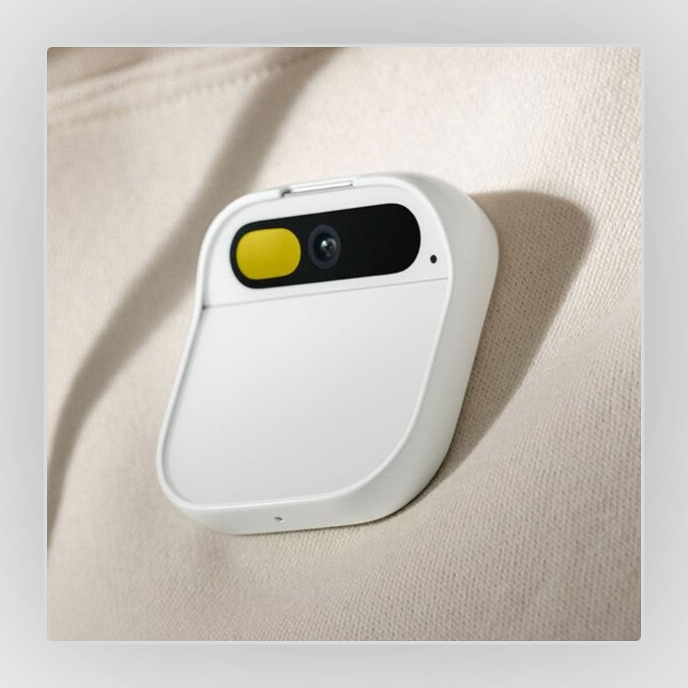

As a product designer, I analysed Humane's first product, the AI Pin, and identified several critical challenges that need to be addressed. While the product's primary purpose of replacing mobile phones is laudable, it faces significant obstacles. Firstly, the device needs to offer a 10X better value proposition than the mobile phone to convince users to switch. However, this proved difficult as the AI Pin struggled to deliver on this promise, particularly in terms of call and message functionality, social media, calendar management, navigation, photography, entertainment, running apps, and more.

Furthermore, the voice-based input/output and low-resolution screen limit the device's usefulness compared to a high-resolution touchscreen display. Additionally, the need for a tap activation can be slow and cumbersome, hindering the AI assistant's utility. Demonstrations showed that the AI assistant takes time to retrieve information and respond, leading to frustration in daily usage.

To improve the product, I would ask the following questions:

1. Why create a phone replacement as the first version of the product? It would have been more effective to demonstrate the usefulness of an always-available AI assistant, as Meta RayBan did.
2. Why use tap as a wake gesture when hot keywords or head turns towards the device could be faster and more hands-free?
3. What were the reasons for not pursuing a smartwatch with video capabilities? A watch offers familiar activation gestures like raising to wake, and provides a screen for information delivery and private touch inputs.

While many have criticised this project, upon closer examination, it appears that the product was rushed to market rather than be the example of the company's vision. However, there is still hope for Humane as they continue to innovate. A truly effective always-available AI assistant has the potential to improve various aspects of life, and I await their future developments with interest. 

It's hard to go into uncharted waters, and one must admire them for trying.

