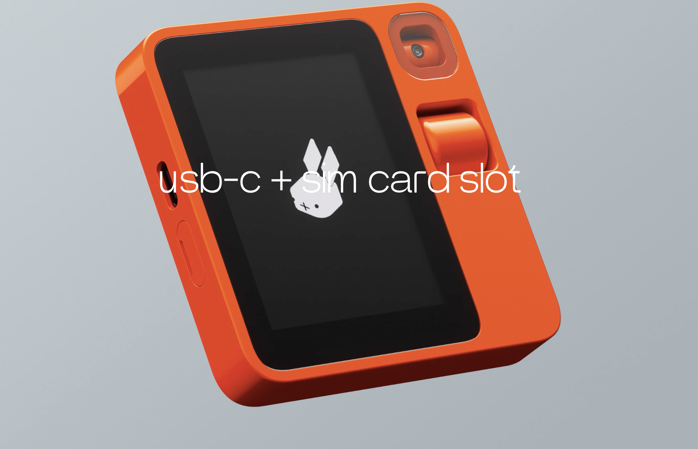

*A detailed review of the newly launched Rabbit R1, exploring its hardware and software design, its strategic position in the market and its potential challenges*

___
# The Launch of Something New

To say that the Rabbit team copied the Steve Jobs keynote would be an understatement! The only thing missing was the Vera Wang turtleneck. It was a black t-shirt instead, but otherwise the same slide style from Apple Keynote with the gradient, the same format for the presentation, the hand gestures, including the "One more thing..." announcement in the end. But OnePlus did this too before, including the turtleneck. While it was thought to be cringe-worthy at the time, the product made up for the lack of originality in presentation. So, let's not get hung up on style and look at the substance instead.
# Background

The tech-world has been in pursuit of two things for the past couple of years. The first is an answer to what replaces the smart phone. Depending on who you ask, the smartphone has stayed relatively the same since its debut in 2007. It's been upgraded in small ways with better screens, cameras and sensors, but otherwise the form-factor has stayed relatively the same since the beginning despite some major flaws in the structure. But it's been more than 16 years, Steve Jobs isn't around and everyone's looking for the smartphone killer.

Secondly, the success of OpenAI's Chat GPT has also indicated to everyone how powerful AI assistants can be. The open-source space has also made giant leaps with Llama 2 and Mistral AI models and you can get the same capabilities of ChatGPT and even the interface running on your local computer with relative ease with things like Ollama.

With the addition of vision, audio and speech capabilities into AI models, it is now ready to get out of the browser and into the lives of people, being within their own worlds understanding instructions within their own contexts. For this, they may need to leave desktop browser windows and get into the mobile phones instead. But mobile phones are still a reach-into-your-pockets-or-handbag away and that's not good enough either. People need something even more readily available. Enter Meta RayBan, Humane's AI Pin, etc. 

Thirdly, these models have so far been hamstrung by their inability to perform actions on behalf of the user. They cannot yet click buttons on screens and other interfaces and the OS architecture and security doesn't allow an app to interact with the interfaces of other apps as yet, and rightly so. But this also means that we have to duplicate actions and information across apps in order to achieve some goals. 

With this backdrop, I think we can evaluate what Rabbit R1 is doing much more accurately. 

# Hardware Design

It seems they hired [teenageengineering](https://twitter.com/@teenageengin33r) (nice name), which seems to have an inclination to create retro-futuristic looking tech products and reminds me of the stuff created by Dieter Rahms's Braun products. The design is a very cool, lego-inspired shell that houses a great looking touchscreen, a camera on a swivel, a scroll wheel, mics, a slot for USB and SIM cards and a push-button on the right of the product. 

But the touchscreen is a great addition and makes interacting with apps, seeing information delivery much faster, answering questions and such much, much faster than audio based delivery which the AI Pin by Humane chose to do.

The camera on a swivel seems like a good idea as the R1 can potentially scan the environment to find what a user may be referring to in their instructions. But the plastic above the camera will not let the device be held in an angle less than about 45 degrees and the user will need to position the device almost vertically like they do smartphones for the camera to be able to see. This is weird, so I am not sure why this choice was made either. Why not just position the camera on the very edge without the top plastic part causing an obstruction?

I'm also not able to rationalise the use of the analog scroll wheel. Is it meant to help make choices within the touch screen? Doesn't seem likely as its potentially faster to use your finger to scroll on the touchscreen. Is it meant to manually position the camera? If that's the case, positioning it to the right of the camera would have been better. Is it meant to make scrolling on the touchscreen a single-handed operation? If I was holding it in my left hand, using my index finger to scroll the screen instead of my thumb on the screen *may* be easier, but I'll probably still have to make button selections and for that I may be hitting the push-button. This seems like learned behaviour but the only explanation I can come up with given my limited understanding. But if you hold this device in you right hand, you can't explain the position of the scroll wheel at all! You can't scroll with the thumb which is holding the side of the device and you can't use your left hand to use the scroll wheel as you'll block your view of the screen. So, why then?

Finally, I didn't see any ways for the product to be put onto a jacket or shirt and the placement of the screen and the push-button seems to indicate that the R1 is meant to be carried in a pocket and pulled out when it needs to be used. This is a big red flag for me. An AI companion needs to be always available within the context of the user's physical space in order to understand instructions better (and to keep the instructions simpler). If it needs to be pulled out of a pocket or more likely from a bag as the smartphone will be in the pocket, this will not be as easily accessible. The AI Pin did better in this regard by being always accessible from the t-shirt or jacket where it is clamped. The Meta RayBan was another good attempt at this but given that they are sunglasses, the ability to wear them all the time is nearly impossible.

# Software Design

Jesse Lyu, the founder and CEO begins his keynote by actually recognising one of the most fundamental issues with the way smartphones are designed. This is an extremely deep insight and I'm so glad someone on such a large stage was able to express this. 

During the early days of the smartphone, Apple proudly used the line, "There's an app for that" in their marketing to highlight how many apps there were in the App Store. You see, in their view, there was an app that could achieve any task that you wanted to do. But the mental model of a person who wants to perform a specific task needs to then make a choice in their minds of the app that would enable to do it and then open that app and then make the right choices in the interfaces in order to achieve that task. If you've got more than one app that could help you do that task, there's some time spent in your mind making a choice between them. And if you have a task that needs more than one task to be achieved, you've just made the choices even more complex. Given that most people have about 90 different apps on their phones on average, this isn't a small matter.

You also need to have downloaded these app ahead of time in anticipation of a need for it in the future. But that's another story altogether. 

This is also third-generation thinking where you have to think of the objective you need to achieve and then break it down into the steps required in order for the computer to help you achieve it. Contrast that with the fourth-generation thinking which simply needs the user to clearly express the goal and the computer then breaks down the tasks into the atomic bits, figures out the best tools to use to solve the problem and solves it. This was science fiction before the advent of AI. This is reality today.

There's also the duplication of data and instructions between the apps to contend with. For example, travelling somewhere on a vacation requires an app for flight bookings, an app for hotel bookings, an app to book a ride and another to research the highlights of the destination. Each of them will ask you for your name, dates, times and locations, your companions, your preferences, over and over again. And that's not even considering the fact that you need to register with each app too!

This *is* a problem today and Jesse and company used this idea as the foundation to build their solution to combat this problem. Kudos to them to being able to figure out a way around with their Rabbit Hole interface, even though it doesn't yet completely solve *all* the problems as yet.

There's much more to say about the software, the interfaces and the UI design which are all brilliant, but table-stakes for a game this big. The fact that they understood the above point and also broke through the 500ms (while not yet hitting the Doherty Threshold) makes the device feel really responsive is just amazing. 
# Business Design

The fact that the product was launched at $199 is simply a master stroke. A device that purports to be an AI Companion is really only that useful today and the price-point is perfect. But how could they not have a recurring monthly fee? They have to have servers running in the background to serve the needs of the users. How do they expect to fund this? 

To me, this is where the Rabbit Hole comes in. I think the apps need to pay to be listed there. Maybe not initially, but eventually. They also may have a local model running on the device that handles the majority of the daily queries and only passing along the complex ones to the server a la [Mixtral of Experts](https://mistral.ai/news/mixtral-of-experts/). This would keep their costs low too. 

There is a possibility where they are going to be the benefactors of a model that understands the physical world of the user better. This is green-field at the moment and they are going to be one of the first to occupy this space. 

But this is me just conjecturing and the answer may be far simpler and the operational costs may just be borne through VC funding until they hit some kind of a threshold. Or maybe it has to do with advertising a. k. a. "recommendations" that the agent provides. 

# Conclusion

The R1 is intriguing and addresses some key concerns of mobile computing. However, several challenges persist. While Rabbit R1 excels in software, the hardware design falls short of being an effective AI companion. A smart watch with a camera still remains the form factor to beat. Given these shortcomings, I predict limited usage and abandonment by most users within a few months unless these improvements are implemented by the time they start shipping in March.

With regards to competition, this concept could easily be replicated by smartphone manufacturers. If they cannot produce it independently, an acquisition could be on the cards, which may be the anticipated endgame anyway.

For any AI companion the major obstacle remains payments. The demo didn't quite show how the many payments that were alluded to be taking place actually happened and I'm curious to see how this bit works. 

While I don't personally wish to purchase this product due to the aforementioned issues and deficiencies, I still regard it as a 'directional innovation' that pushes the industry in the proper direction. There will be numerous iterations before the ideal form factor for the product is realized, as well as the perfect business models for the companies backing them. Consequently, I intend to keep a close eye on Jesse and his team to see if they adapt and iterate as I anticipate they will.