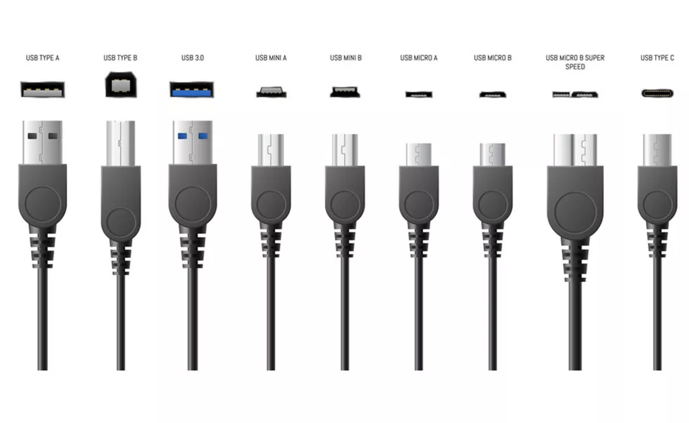
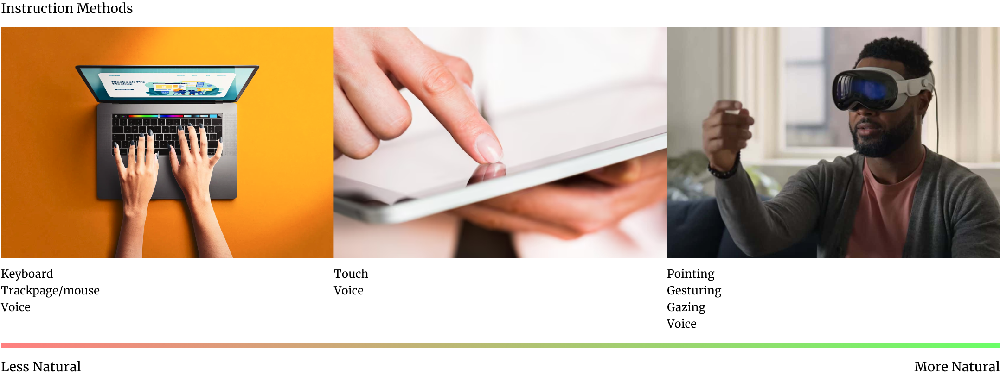

*Product design requires you to imagine the future version of a product, but how do you do it reliably? Ice Hockey may offer some insights.*

___
# Ice Hockey and Product Design

According to the Wayne Gretsky quote that goes, "I skate to where the puck is going to be, not where it is", the way to win is to accurately anticipate the future outcomes as accurately as possible. The principle could be applied to product design too. The way to design a successful product is to know what the next version of the product is going to be. But the challenge of knowing what that is as challenging as judging where the hockey puck is going to be on the ice rink. 

But while no one can be absolutely certain where exactly the puck is going to be on the rink at any given point in time, one thing everyone can be absolutely certain about is that the puck is headed towards the other team's goal. In a similar way the product's end goal is to suit the needs of the consumer perfectly.

The consumer is human. The form the product must then take is to suit the form of a human body. If the product is meant to be held, it must fit the hand perfectly. If it is meant to be worn on the ear, then it must fit various ear types. If it is meant to be used over a period of time, then it must use materials that will not strain the user during that period. In terms of the function it performs, it must serve the needs of the human as accurately while also needing as little effort as possible. The final version of the product therefore is possible to define, at least in the abstract. If it's not a physical product, the final form is one that serves the needs of the user perfectly and is extremely simple to use.

Let me illustrate the idea with some examples. Consider the evolution of the USB cable. Type A USB cables required the user guess which way should be facing up before plugging it into a socket. Many users struggled with this and the act of plugging in the USB A cable into a socket was a hit or a miss *every time*. Making the cable pluggable into a socket in either orientation therefore was obvious. Therefore that's what happened in the future iteration of the USB C cable. 

Another issue with the cable was that the sockets it plugged into on the other side was variable. There were the USB A plug, USB B plug, a mini USB plug and even a micro USB plug. You therefore had to have at least one cable of each type in order to be able to connect with various device types that one bought over time, not to mention the proprietary cables that were required by some devices like smart watches. Intuitively one can see that these were too many cables to basically perform the same task. Again, no wonder the USB C cable's invention. As of the time of writing this article, the USB C cable too has various types, the ones that supply current and the ones that also transfer data. How long do you think that's going to stay that way? 

The same principle can be applied to Generative AI tools -- do you think specialised prompts are going to be required much longer; computer keyboards -- are they more convenient than speech;  or even subscription services -- will Adobe get away with charging cancellation charges for their subscription service for much longer?

Or even consider the iPad. What was it's evolution? I'd postulate that it came about because someone thought that the computers of the time were too "unnatural" for a human to use. Having a user type using a keyboard to communicate something or using a mouse or a track pad to point at something is a hard challenge for people who aren't familiar with computers. Humans communicate by speaking, they point to things with their fingers. The iPad is a step in that direction. What would the future of this device be? Well, a computer that let's a user express themselves with all the tools they have at their disposal -- from communicating with their voice, pointing with their fingers or even setting the context of what they're talking about by facing in a particular direction or looking at something with their eyes. The display of the iPad is an intermediate expression of the limitations of current technology. The computer of the future will not be something that is picked up and stared at with your head bent down. If you think the Apple Vision Pro headset is a step in that direction, I would agree that it is. But it's not the end point. 

The end point is something that will be even more seamless. It will be an assistant that the user can just converse with, something that can understand the full range of expressions that humans can emote with their faces, eyes, hand gestures, body positions and language and it will be seamless and something that is worn and always available. It will enable the user to do and perform everything they need in the real world but also to understand and appreciate everything much more.

For this to happen, we need a voice assistant with infinite knowledge and ability to learn about the human, wireless technologies that will seamlessly stay connected at all times, face tracking, body tracking, motion tracking, gesture tracking and even battery technology that will not only power something like this, but be in a form that is far more shaped like the person who will wear it.

These intermediate states therefore are not dictated not by the human being it is meant to serve, but by other constraints such as materials available, the tools, technologies, the people available to build that next version, legal and environmental constraints, the organisational politics, available marketing budgets or even the designer's inability to understand who the user is. But knowing that these are necessary stages of evolution will allow the designers to keep their eye on the eventual goal. The task of the product designer or even the entrepreneur building this product is to negotiate the most efficient course between the current state of the product through to the final destination it is meant to be.