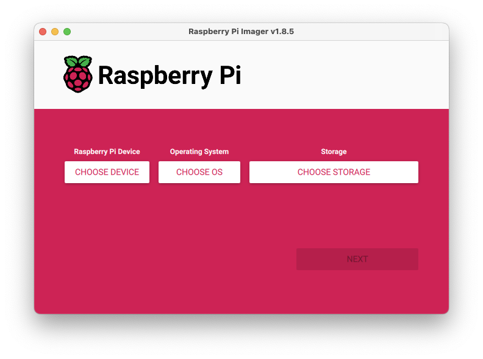
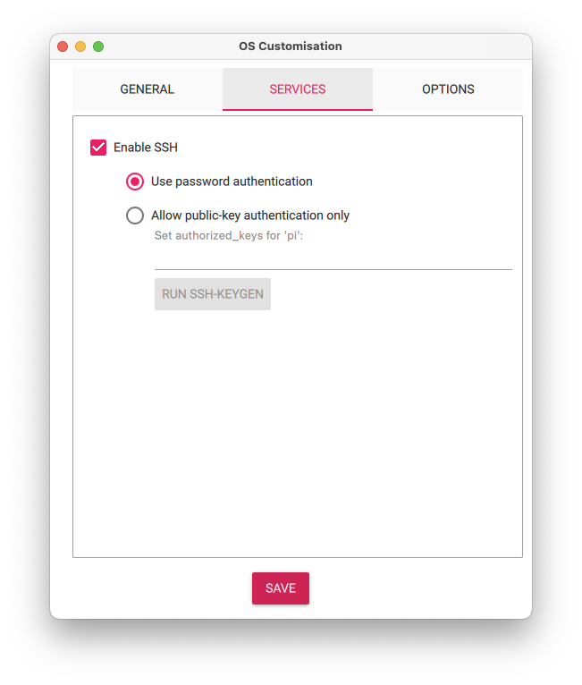
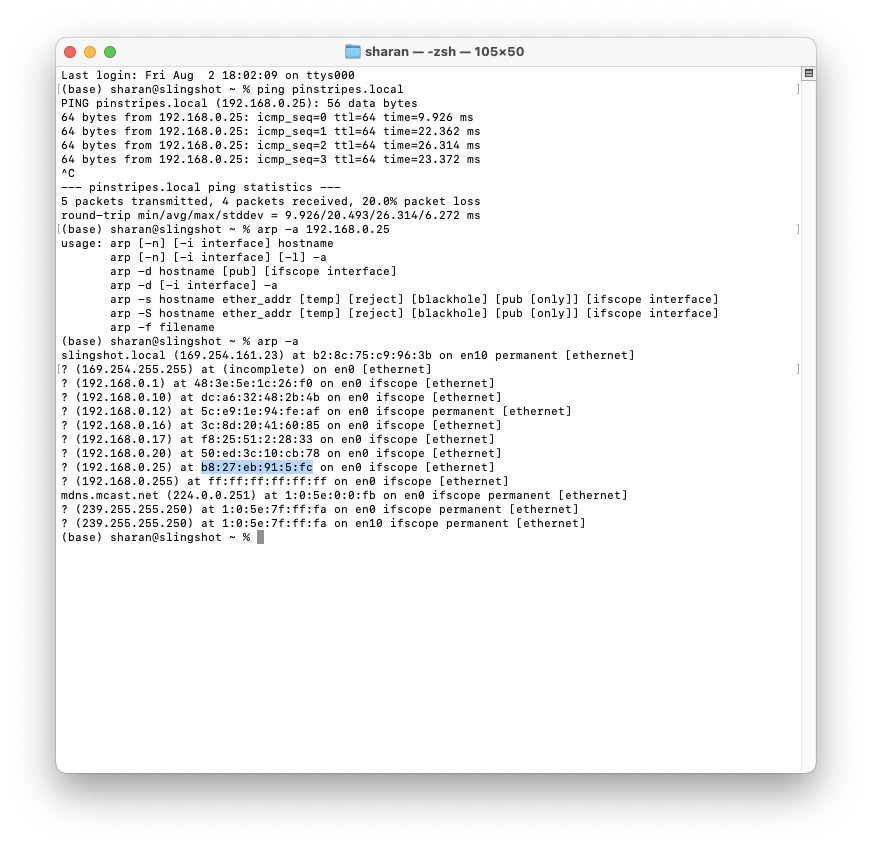
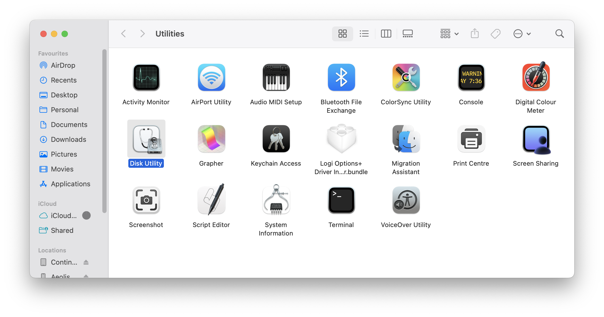
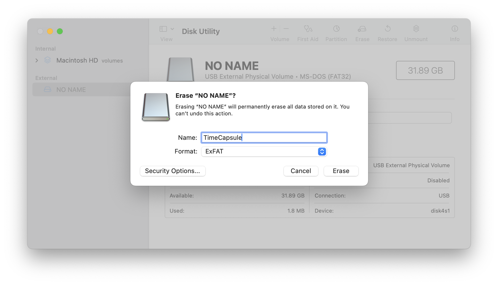
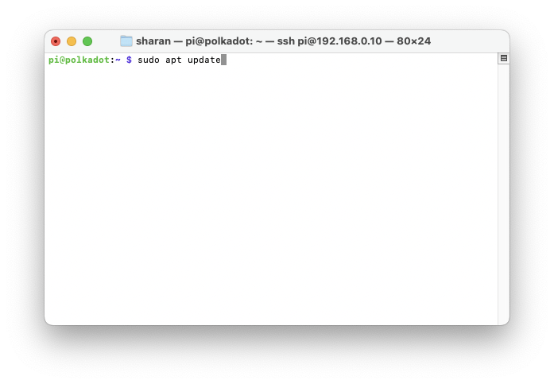
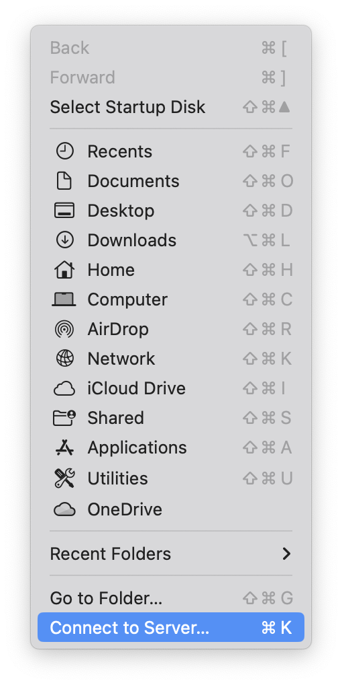
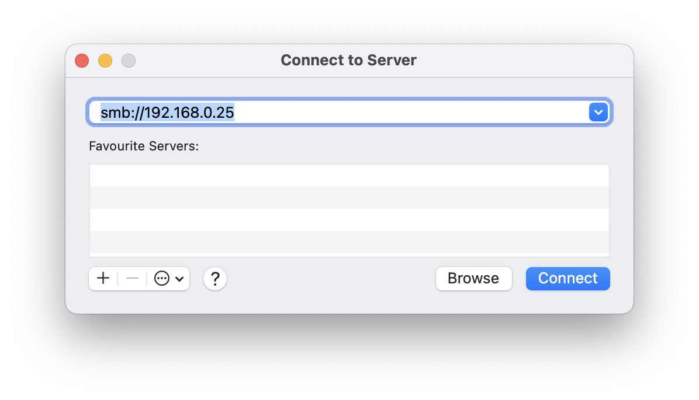

*I built an efficient Apple Time Capsule clone that will perform the task of allowing any externally connected hard drive to be used as a backup destination using the Time Machine setup on your Mac.* 

___

## What this is

If you want to build your own Apple Time Capsule clone using the Raspberry Pi and an external hard drive, this is the slimmest and most efficient solution that you could build in under an hour, without the bonus 3D printing bit in the end of course!

You may also be successful if you just follow the steps below, but there's a step where you need to find your Raspberry Pi on your network and reserve a specific IP address in your router which I won't be going into that may require some prior knowledge.

## What's unique about this solution

This solution has the following characteristics that make it different from other solutions that you may have seen:

* You don't need any other software such as Open Media Vault, which is great if you want to do a whole bunch of other things, but is too much of an overhead if all you want to do is build a network backup solution
* This could be setup on very low horse-powered boards like the Raspberry Pi 3A+ as it runs with the services built into the OS
* This solution works with more than one Mac on your network
* It can do this for guest logins on a network and doesn't require an account to be setup on the Pi, so this makes it easy to use for a home environment

## Requirements

You need the following as a minimum:

1. Raspberry Pi 3 Model A+ with compatible power supply
2. Micro SD Card with 4GB or more
3. External hard drive of any capacity that is compatible with the Raspberry Pi's USB port
4. The drive will work with most laptops using different OS's in case that's needed at any time
5. Raspberry Pi Imager software

## Software Setup

### Step 1: Create the SD card image

For this, simply do the following:

**1.1** Download the [Raspberry Pi Imager](https://www.raspberrypi.com/software/) software and open the file and follow the instructions to install the software on your Mac as you would any other software
   

**1.2** Plug in the Micro SD card into your Mac. It doesn't matter if it isn't already formatted.

**1.3** Choose the Raspberry Pi OS Lite (64-bit) image to write to the Micro SD card
   

**1.4** Choose the Micro SD card that you just inserted into your Mac as the storage destination and click 'Next'
   
**1.5** In the next step of OS customisation, make sure to Edit Settings and in the first tab
   

**1.5.1** Setup the host name -- this is the name of your Pi on the network. I've called mine "pinstripes", but you could just call it "timecapsule" or anything else you'd like
     

**1.5.2** User name and password for the machine. I suggest you set it to the default username and password for now which are 'pi' and 'raspberry'. You can change this later if you'd like.

**1.5.3** Provide the SSID and password to enable it to connect to your Wifi network. You don't need this if you're using a different Raspberry Pi that connects using a LAN cable.

**1.5.4** On the second tab called "Services", make sure that you enable SSH and use the password authentication mechanism. This will allow you to remotely log into your Pi with the user name and password that you setup in the previous step.
   

**1.5.5** Hit "Save" and in the next screen click "Yes" and then "Next" to begin the imaging step. You may need to type in your login and password for your computer to tell your computer that you authorise this action.

In about 15 minutes your Micro SD card is going to be ready. Just eject your card if not already done before pulling it out of your computer.

### Step 2: Initialise your Pi and set it up on your network

**2.1** Setup the host name -- this is the name of your Pi on the network, so you could just call it "timecapsule" for simplicity or name it anything else you'd likePlug in your Micro SD card into your Pi and then plug in the power cable to the Pi. After about 5 minutes, the Pi would have booted up and then connected to your network over Wifi (or LAN in case that's how you'd connected). You don't need to plug in your external hard drive to the Pi as yet. 

**2.2**  Open up a Terminal window on a laptop on the network and type in `ping timecapsule.local`. Replace "timecapsule" with whatever you named your Pi in Step 1.5.1. This should return the IP address of your Pi on the network.
   

**2.3**  Now type in `arp -a` and get the MAC addresses of all the devices connected to your network. Look for the Pi's MAC address that corresponds to its IP address you found in the previous step.

**2.4** Now log into your router which assigns the IP addresses on your network and setup a fixed IP address for your Raspberry Pi's MAC address. This whole thing may work without this address reservation, but I've never tested it. So if you absolutely cannot perform this step, just go through the rest and let me know if it works for you.

 **2.5** If you've reserved a specific IP address for your Pi and it is different from the one it is currently assigned, you will need to reboot your Pi by turning off the power. 

**2.6** Once your Pi comes back on your network, go back to your Terminal window and type in the following to log into your Pi through SSH - `ssh pi@192.168.0.10` where 'pi' is the user name and the IP address is the one that you reserved for your Pi in step 2.4. If everything is setup properly, your Pi will ask you for a password and you could just type in 'raspberry' or whatever else you set up in Step 1.5.2. 

### Step 3: Prepare your external hard drive

**3.1** Get your external drive. Be sure you're using a hard drive that doesn't have any data that you want to retain as it will be lost forever once you're done with this step. Connect the hard drive to your Mac.

**3.2** Use "Disk Utility" to Erase and initialise your external drive. Name the drive anything you'd like such as "TimeCapsule" but make sure to use "Exfat" and if asked, the "GUID" options for maximum compatibility of the drive across different OS's. 

**3.3** Once the process is complete, eject your drive from your laptop. It is ready for plugging into your Pi in the next step.

### Step 4: Get the software setup 

 **4.1** While connected to your Pi through a Terminal window, do the following to update your Pi's OS:
 
 

	1. `sudo apt update`
	2. `sudo apt upgrade`
	3. `sudo apt install exfat-fuse -y`
	4. `sudo apt install samba -y
	5. `sudo apt install avahi-daemon -y`

 **4.2** Once the above packages are installed, let's mount the external drive.
 
 **4.2.1** Plug in your external drive into the Pi

**4.2.2** Type in `sudo df -Th` which will list all the drives connected to the Pi. Find the identifier for your drive which should most likely be "sda2" but could be different too. 

**4.2.3** Create a mount point by typing in the following commands `sudo mkdir /mnt/timecapsule` and `sudo mount -t exfat /dev/sda2 /mnt/timecapsule`. Just substitute "sda2" with whatever the drive's identifier actually is. 

**4.2.4** Type in the following to find the UUID of your drive `lsblk -f` and all the drives connected to your Pi will show up (including the Micro SD card). Look for the UUID of the drive with the label 'TimeCapsule' if that's what you named the drive in Step 3.2. Cross verify against the size of the drive to be sure. Copy the UUID into the clipboard.

**4.2.5** To make the mount point persist across reboots of the Pi, you will need to add the following code to the file named "fstab". You can do that by: `sudo nano /etc/fstab`

**4.2.6** Paste the following in the end of the file  `UUID=your-uuid /mnt/timecapsule exfat defaults,uid=1000,gid=1000,umask=000 0 0` but replace the UUID with the one you copied to the clipboard in the previous step.

**4.2.7** Press Ctrl-X to save the file, Yes to write the buffer to file and enter to rewrite the file.

**4.3** Now write the configuration file to Samba, which is the file networking service that shows the drive on a network in a form that is compatible with Macs and Windows. To do this, you need to write the following code into the `smb.conf` file by typing in `sudo nano /etc/samba/smb.conf` which should bring up the existing configurations in the file. Press the page down key on your keyboard to get to the end of the page and paste this and make sure the mount points are correct:

**4.4** Save the file as the other files in step 2.5.3 and then restart the service with the new configurations by typing in the command into your command prompt in the Terminal `sudo systemctl restart smbd`

**4.5** We've got to do the same for the avahi service configuration. To edit the file, `sudo nano /etc/avahi/services/samba.service` and paste the following code. There are no changes needed to be made.

**4.6** Save the file as in step 2.5.3 and then restart the service by typing in the following command `sudo systemctl restart avahi-daemon`

I suggest restarting the device itself to make sure that it works even if it ends up restarting on it's own in the future. To do this, type in `sudo reboot now` into your Terminal command prompt. This will disconnect your session and restart the Raspberry Pi. 

That's it, you're ready to go and setup the Time Machine backup from your Mac as always! 

## Troubleshooting

If for any reason you don't see the newly setup drive when you are setting up Time Machine on your Mac, try to connect to the drive first on the network by going to the Finder > Go > Connect to Server and then typing in `smb://192.168.0.25` replacing this with the IP address of your newly setup Time Capsule. You should be able to connect to the Raspberry Pi drive. Post that the Time Machine should automatically find the drive on the network. If for any reason this still doesn't work, there's probably some step above that you've missed. So give that a shot again.

## Bonus Step

Make a case for the Raspberry Pi and the hard drive to be situated together. I'm designing something for this purpose and should have a 3D printable file posted here soon. Check back in a bit. But if you'd like to print something else, look at the plethora of stuff that's available to you on [Printables](https://www.printables.com/search/models?q=raspberry%20pi%203a+&ctx=models).

